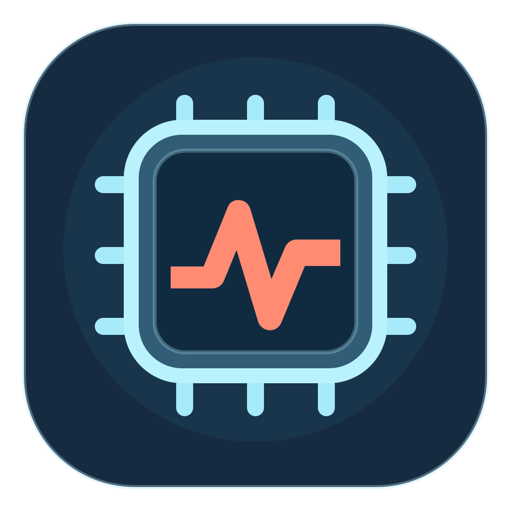

<p align="center">
  
</p>

<h1 align="center">CPU Load Bar</h1>

<p align="center">
  A tiny, native macOS menu bar app that keeps the current CPU load average visible at a glance.
</p>

<p align="center">
  <a href="https://github.com/mguellsegarra/cpu-load-bar/actions/workflows/ci.yml"></a>
  <a href="https://support.apple.com/macos"></a>
  <a href="https://www.swift.org/"></a>
  <a href="LICENSE"></a>
</p>

CPU Load Bar shows the one-minute load average beside a native CPU symbol. Open its menu for the 1, 5 and 15-minute values, the number of logical CPUs, a manual refresh action and Quit.

<p align="center">
  
  <br />
  <sub>CPU alert · top processes and memory pressure at a glance</sub>
</p>

The screenshot was captured before the memory-pressure level correction; current builds show macOS warnings as **warning**, not **urgent**.

## Features

- Native Swift and AppKit
- Custom app icon with an editable SVG source
- Universal binary for Apple Silicon and Intel Macs
- One-minute load visible in the menu bar
- 1, 5 and 15-minute values in the menu
- One-click access to Activity Monitor
- Native Open at Login toggle
- Top three CPU or memory-consuming processes while an alert is active
- Native, short-lived confirmation after copying a process name
- Purple memory-chip indicator when memory pressure is critical and CPU load is normal
- Memory-pressure menu detail graded by level: yellow for warning and red for critical
- Alert colors adapt to light and dark appearances; normal text follows macOS menu bar colors
- Progressive CPU alert colors based on load per active CPU
- Two-second refresh interval
- VoiceOver label and current-value support
- No Dock icon, third-party dependencies, network requests, analytics or stored data

## Requirements

- macOS 13 Ventura or newer

## Install

Download `CPU-Load-Bar.dmg` from [GitHub Releases](https://github.com/mguellsegarra/cpu-load-bar/releases), open it and drag **CPU Load Bar.app** onto **Applications**.

The downloadable app is ad-hoc signed but not Apple-notarized. On first launch, macOS may require you to right-click the app and choose **Open**.

## Build from source

Xcode with the macOS SDK and Swift 6 are required.

```sh
git clone https://github.com/mguellsegarra/cpu-load-bar.git
cd cpu-load-bar
./scripts/build-app.sh
ditto "build/CPU Load Bar.app" "/Applications/CPU Load Bar.app"
open "/Applications/CPU Load Bar.app"
```

The script builds a universal release binary, creates the app bundle at `build/CPU Load Bar.app`, and applies an ad-hoc signature.
Quit any running copy before replacing it. On macOS 27, run the app from `/Applications` for reliable menu bar visibility, especially with Bartender; running the build copy directly may make the item appear missing.

The app icon is generated from `Resources/AppIcon.svg`. To regenerate `Resources/AppIcon.icns` after editing the SVG, install ImageMagick and run `./scripts/build-icon.sh`.
To build the drag-to-Applications disk image locally, install ImageMagick and run `./scripts/build-dmg.sh`. The DMG will be written to `build/CPU-Load-Bar.dmg`.

## Understanding load average

Load average is not a CPU percentage. It represents runnable or waiting work averaged over time. As a rough guide, a load near the number of logical CPUs means the machine has approximately one runnable task per logical CPU.

Click the menu item to compare the 1, 5 and 15-minute values and see the logical CPU count reported by macOS.

The menu bar indicator prioritizes the signal that needs attention:

1. The one-minute CPU load is divided by the number of active logical CPUs. This ratio alone determines the CPU indicator color. The menu also shows **CPU busy (recent)** as context; it does not change the color.
2. A memory **Warning** is shown only inside the menu, in yellow. When CPU load is below its threshold but memory pressure becomes **Critical**, the menu bar changes to a purple memory-chip indicator.
3. Otherwise, the normal CPU load remains visible using the standard menu bar color.

The icon and value share the same color, with a light- and dark-mode variant.

| Level | One-minute load per active CPU | Light | Dark |
| --- | ---: | --- | --- |
| Normal | < 1.5 | System label color | System label color |
| Elevated | ≥ 1.5 and < 3 | `#9A4A37` | `#D9957F` |
| High | ≥ 3 and < 5 | `#AE2F2C` | `#EB7067` |
| Extreme | ≥ 5 | `#77112D` | `#FF4969` |

These are visual heuristics, not a claim that the Mac is slow or in danger. Load average can remain high briefly after a demanding task ends. Recent CPU usage is sampled from native macOS CPU-time counters and smoothed for the informational menu value.

While an alert is active, the menu lists the three processes using the most CPU or resident memory directly below **Open Activity Monitor**. Click a process to copy its name to the clipboard; a brief confirmation appears centered below the menu bar on that screen. The rows stay fixed while the menu is open, so the name you click is the name copied. The list refreshes every ten seconds in the background when the menu is closed and is hidden when system pressure returns to normal.

## Resource use and privacy

CPU Load Bar calls the native `getloadavg(3)` and Mach CPU-time APIs every two seconds. It does not make network requests, collect analytics or persist information. On the development machine, the idle process measured `0.0%` CPU and approximately `40 MB` resident memory; exact usage varies by macOS version and hardware.

## Development

```sh
swift build
./scripts/build-app.sh
codesign --verify --deep --strict --verbose=2 "build/CPU Load Bar.app"
```

Contributions and bug reports are welcome through GitHub issues and pull requests.

## License

[MIT](LICENSE) © Marc Güell Segarra. More about the author at [Ondori.dev](https://ondori.dev/). If you find the app useful, you can [buy me a coffee](https://buymeacoffee.com/mguellsegarra).
